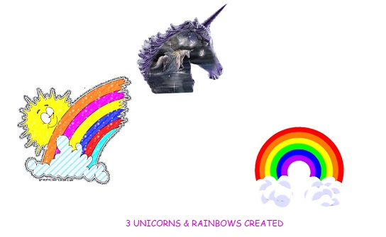

## JavaScript30 Day 12 - Key Sequence Detection

When someone enters a sequence of keys into your window, something needs to happen. For example, the KONAMI Code from the 90s, when user press up up down down left right left right B A and start, you will get unlimited life in Mario's game.

In this tutorial, we will implement similar key sequence detection. When they correct key sequence 'edwin' is entered, a picture of unicorn or rainbow or random stuff will be added to the screen.

[View demo site here.](https://webdevtuts.github.io/javascript30_12/)

